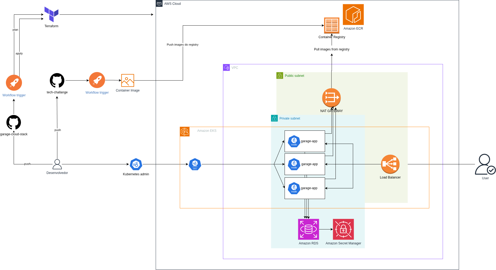

## Provisionamento da infraestrutura para a aplicação Garage

Para construção e atualização da infraestrutura AWS usando Terraform acesse [a documentação da infra em terraform](docs/TERRAFORM.md)
O deploy é automatizado quando o merge é feito na main.

## Diagrama de Arquitetura de Infraestrutura

